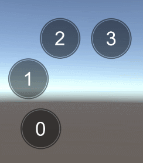

# RoundScroll
## 转盘式循环滚动框：ScrollRound
一个转盘式的循环滚动框，主要用来做MMO中的技能快捷键轮盘， 因为有时候玩家可能会配置多套技能方案，用来实现快速切换不同的技能方案。借鉴了之前做的 用于聊天的 自定义Item尺寸循环列表的思路。
先放一段效果：


主要分几个部分：
ScrollRound.cs 将ScrollRect改为角度变化实现。
RoundLoopLayout.cs 循环LayOut的实现，思路与以前写的GridAndLoopAdapt类似。
RoundCenter.cs 主要实现拖动过程中的一个居中效果。

### ScrollRound.cs实现转盘式滚动
代码最初拷自ScrollRect的实现，为了做到差不多的效果，但是ScrollRect里的东西实在太多了，删掉一些不需要的，再将坐标计算改成角度计算。
主要的两个方法:
OnDrag 和 LateUpdate
##### OnDrag计算滑动角度
原本的OnDrage里做的是一个坐标的计算操作，这里改为localEulerAngles的计算。

##### LateUpdate惯性变化
------------------------------------------------------------

## 转盘式循环滚动框：RoundLoopLayout
类比列表式的滑动列表会有一个头部和尾部，列表元素在滑动的时候检查是否超出头部和尾部，然后通过移除超出边界的元素，补到另一端，同时刷新元素内容的方式。
虽然变成了转盘式的列表，但是同样的也会有列表的头部和尾部，原本限定头部和尾部用的是坐标，而这里要改为角度，设置一个头部裁剪角度和尾部裁剪角度，滑动的时候将超出角度范围的元素移除复用。
维护一个topRealIndex，用来标记当前头部元素的真实下标（因为元素是复用的，头部的元素下标始终为0，真实下标则会随着滑动累加），所有列表元素的角度，坐标，和真实下标，以及后续的一些跳转定位到某个元素位置等都将基于这个topRealIndex计算。

##### 主要的几个方法：
```csharp
bool CheckTop()
{
    int count = m_ChildItems.Count;
    bool have = false;
    for(int i = 0; i < count ; i++)
    {
        if(CheckOutOfTop(0))
        {
            RectTransform item = m_ChildItems[0];
            m_ChildItems.RemoveAt(0);
            m_ChildItems.Add(item);
            topRealIndex++;
            int wrapIndex = count - 1;
            SetChildPosition(wrapIndex);
            item.transform.SetAsLastSibling();
            UpdateItemData(wrapIndex);
            have = true;
        }else
        {
            break;
        }
    }
    return have;
}

bool CheckOutOfTop(int index)
{
    RectTransform item = m_ChildItems[index];
    float angle = GetItemAngleRelaScroll(item.gameObject);
    if(m_IsClockwise)
    {
        if (m_CullTrailAngle > m_CullTopAngle)
        {
            return angle > m_CullTopAngle && angle <= m_CullTrailAngle;
        }
        else
        {
            return angle > m_CullTopAngle || angle <= m_CullTrailAngle;
        }
    }else
    {
        if(m_CullTrailAngle > m_CullTopAngle)
        {
            return angle < m_CullTopAngle || angle >= m_CullTrailAngle;
        }else
        {
            return angle < m_CullTopAngle && angle >= m_CullTrailAngle;
        }
    }
}
```
检查头部元素是否超出设定的头部裁剪角度范围m_CullTopAngle，超出则将头部元素移除放到尾部，并重新按照元素RealIndex设置元素坐标，然后回调UpdateItemData事件，通知业务层刷新元素内容。
注意这里的角度计算方式是按照x轴正方向为0度轴，逆时针方向计算的，也就是(0,0)=>0度，(0,1)=>90度，(-1,0)=>180度，(1,0)=>270度，这样，整个计算过程中需要限定所有的角度在(0,360)之间。
m_IsCloclwise表示圆盘中的元素排列方向是顺时针还是逆时针，排列方式不同，关于边界的判定也会不同，相当于做了一个镜像翻转。大概像这样。

关于尾部的检查跟头部类似，就不放了。把这两个方法注册到ScrollRound的滑动回调事件中，每次滑动的时候检查是否超边界，然后重置刷新元素即可。
#### 看下获取元素角度的方法
```csharp
public float GetItemAngleRelaScroll(GameObject go)
{
    Vector3 pos = m_Scroll.transform.InverseTransformPoint(go.transform.position);
    float angle;
    if (pos.x == 0)
    {
        angle = pos.y > 0 ? 90 : 270;
    }else if(pos.y == 0)
    {
        angle = pos.x > 0 ? 0 : 180;
    }
    else
    {
        float rad = Mathf.Atan2(pos.y, pos.x);
        angle = Mathf.Rad2Deg * rad;
        //因为Atan2得出的角度在不同象限会相同，这里根据y轴的正负情况 把角度限定在0 - 360度之间
        if (angle < 0)
        {
            angle += 180;
        }
        if (pos.y < 0)
        {
            angle += 180;
        }
    }
    return angle;
}
```
获取元素相对于ScrollRound的角度值，为了方便计算，需要将所有角度限定在0，360度之间，由于Atan2在不同象限计算值可能会相同，并且对于钝角可能得出负数角度，所以这里做了一个校正。
```csharp
void SetChildPosition(int index)
{
    if (index < 0 || index >= m_ChildItems.Count) return;
    int realIndex = GetRealIndex(index);
    float angle = m_StartAngle + (realIndex * m_CellAngle) * (m_IsClockwise ? -1 :1);
    float rad = Mathf.Deg2Rad * angle;
    RectTransform child = m_ChildItems[index];
    float x = m_Radius * Mathf.Cos(rad);
    float y = m_Radius * Mathf.Sin(rad);
    child.localPosition = new Vector3(x, y, 0);
}
```
根据元素realIndex计算对应坐标值。

##### 再看一个关于滑动元素定位的方法
```csharp
public void LocationToRealIndexOnTop(int realIndex)
{
    ResetTopRealIndex(realIndex);
    Vector3 angles = transform.localEulerAngles;
    float topAngle = m_OrgAngle + (topRealIndex * m_CellAngle) * (m_IsClockwise ? -1 : 1);
    angles.z = -topAngle;
    transform.localEulerAngles = angles;
    RePosition();
    RefreshChildData();
}
```
有时候会有将元素刷新到指定第n个元素的位置（滑过n个元素的位置），因为关于滑动元素与数据层的关系是通过这个realIndex做的映射，所以需要跳转到指定位置的时候可以直接设置当前头部topRealIndex为指定realIndex，然后刷新整个列表即可。